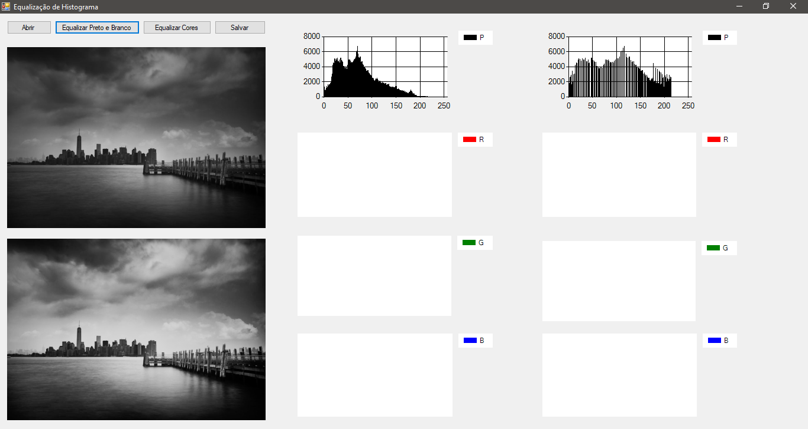
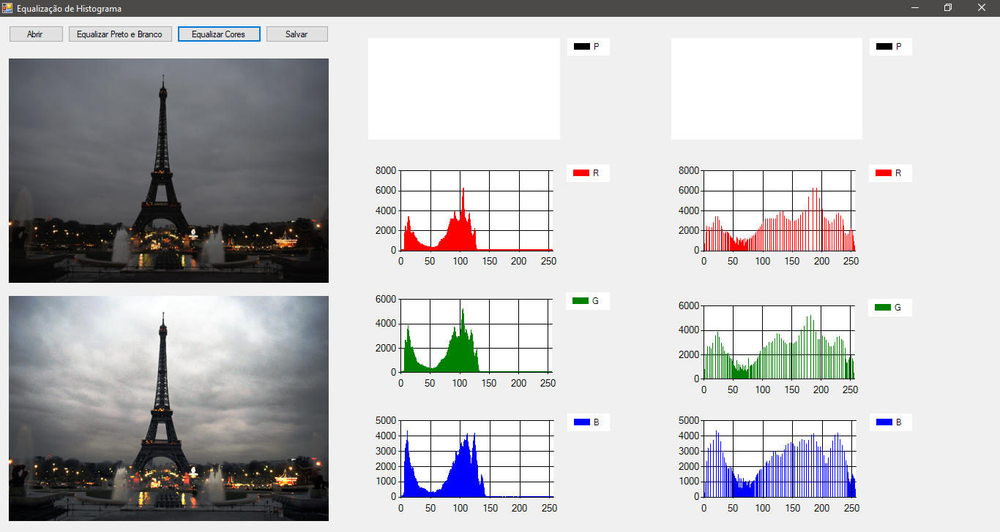

# Equalização de Histogramas com C# 

  Trabalho desenvolvido em C# com Windows Forms na disciplina de Processamento de Imagens(6º Período) do curso de Ciência da Computação, onde foi solicitado pela professora Jaqueline o desenvolvimento de um programa que fosse capaz de extrair e equalizar histogramas de imagens.

  Um Histograma em Processamento de Imagens basicamente é constituído por um número N de vezes em que a intensidade de cor referente a um canal(R,G ou B) se repete em uma imagem. Esta estrutura é fundamental para que se possa equalizar uma imagem, pois nela é possível identificar o contraste de uma imagem e também seu nível de brilho, por meio da distribuição de frequências. O processo de equalizar um histograma é basicamente redistribuir os valores de intensidade de cor para cada canal, Red, Green e Blue(isto se a imagem for colorida, se a imagem for preto e branco, teremos apenas um histograma), de forma mais uniforme.
  
  Como é exibido nas imagens abaixo, na parte superior podemos ver a imagem original e, na parte inferior, a imagem resultante do processo de equalização de histograma. Imediatamente após a conculsão do processo de equalização, podem ser vizualidos também os gráficos referentes aos histogramas da imagem original e da imagem equalizada.

Capturas de tela:

